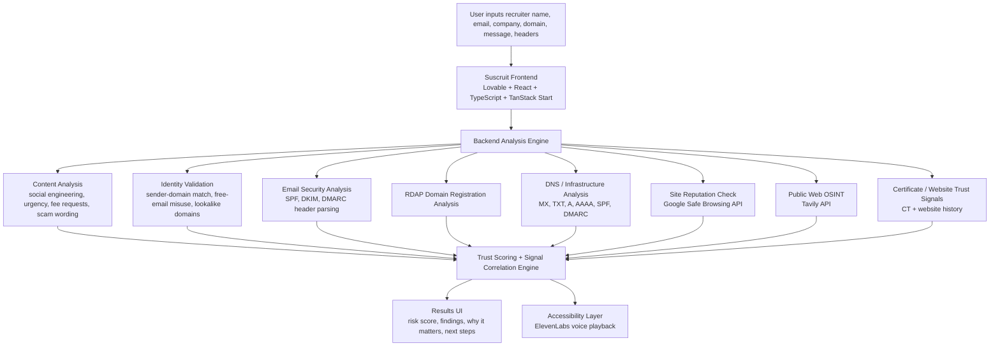

## Architecture

```mermaid
flowchart TD
    A[User inputs recruiter name, email, company, domain, message, headers] --> B[Suscruit Frontend<br/>Lovable + React + TypeScript + TanStack Start]
    B --> C[Backend Analysis Engine]

    C --> D[Content Analysis<br/>social engineering, urgency, fee requests, scam wording]
    C --> E[Identity Validation<br/>sender-domain match, free-email misuse, lookalike domains]
    C --> F[Email Security Analysis<br/>SPF, DKIM, DMARC header parsing]
    C --> G[RDAP Domain Registration Analysis]
    C --> H[DNS / Infrastructure Analysis<br/>MX, TXT, A, AAAA, SPF, DMARC]
    C --> I[Site Reputation Check<br/>Google Safe Browsing API]
    C --> J[Public Web OSINT<br/>Tavily API]
    C --> K[Certificate / Website Trust Signals<br/>CT + website history]

    D --> L[Trust Scoring + Signal Correlation Engine]
    E --> L
    F --> L
    G --> L
    H --> L
    I --> L
    J --> L
    K --> L

    L --> M[Results UI<br/>risk score, findings, why it matters, next steps]
    L --> N[Accessibility Layer<br/>ElevenLabs voice playback]
```

Canvas Cloud AI diagram:  
https://www.canvascloud.ai/view/ztyBCe-A-h
